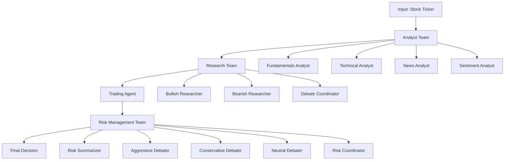

# TraderAgents-Simplified: AI-Powered Trading Decision System

[](https://www.python.org/)
[](https://langchain.com/)
[](https://python-poetry.org/)

## 🌟 Overview

**TraderAgents-Simplified** is an AI-powered multi-agent trading decision system that implements a comprehensive pipeline for stock analysis, research, and risk management. The system uses Large Language Models (LLMs) through a multi-stage workflow to analyze financial data, conduct debates between bullish and bearish perspectives, and make informed trading decisions with integrated risk assessment.

### 🎯 Key Features

- 📊 **Multi-Modal Financial Analysis**: Technical, fundamental, news, and sentiment analysis
- 🤖 **AI-Powered Research Teams**: Bullish vs Bearish researcher agents with debate coordination
- 💼 **Automated Trading Decisions**: Trade proposal generation based on research outcomes
- ⚖️ **Advanced Risk Management**: Multi-perspective risk assessment with aggressive, conservative, and neutral viewpoints
- 🔄 **LangGraph Workflow**: Orchestrated agent interactions using state-of-the-art workflow management
- 🌐 **Real-Time Data Integration**: Live market data via Yahoo Finance and Finnhub APIs

## 🏗️ System Architecture

The system follows a multi-stage pipeline architecture with three main teams:



### 🔍 Pipeline Stages

#### 1. **Analyst Team** (`src/agents/analyst_team/`)
- **Fundamentals Analyst**: Analyzes financial statements, ratios, and company metrics
- **Technical Analyst**: Performs technical analysis using MACD, RSI, and price patterns
- **News Analyst**: Processes recent news headlines and market sentiment
- **Sentiment Analyst**: Evaluates market sentiment and social media indicators

#### 2. **Research Team** (`src/agents/researcher_team/`)
- **Bullish Researcher**: Constructs positive investment thesis based on analyst data
- **Bearish Researcher**: Develops contrarian perspective highlighting risks
- **Debate Coordinator**: Orchestrates structured debate between research perspectives

#### 3. **Trading Agent** (`src/agents/trader_agents/`)
- Generates trade proposals (BUY/SELL/HOLD) based on research debate outcomes
- Calculates position sizing, cost estimates, and portfolio impact
- Fetches real-time pricing data via Yahoo Finance

#### 4. **Risk Management Team** (`src/agents/risk_management_team/`)
- **Risk Summarizer**: Consolidates all analysis into risk assessment
- **Aggressive Debater**: Argues for higher-risk, higher-reward positions
- **Conservative Debater**: Advocates for risk-averse approaches
- **Neutral Debater**: Provides balanced perspective
- **Risk Coordinator**: Makes final risk-adjusted recommendations

## 🚀 Getting Started

### Prerequisites

- **Python 3.12+**
- **Poetry** (for dependency management)
- **API Keys**: 
  - Groq API (for LLM access)
  - Finnhub API (for financial data)
  - Google Gemini API (optional)

### Installation

1. **Clone the repository**:
   ```bash
   git clone https://github.com/your-username/TraderAgents-simplified.git
   cd TraderAgents-simplified
   ```

2. **Install dependencies**:
   ```bash
   poetry install
   ```

3. **Set up environment variables**:
   Create a `.env` file in the project root:
   ```env
   GROQ_API_KEY=your_groq_api_key_here
   FINNHUB_API_KEY=your_finnhub_api_key_here
   GEMINI_API_KEY=your_gemini_api_key_here
   GOOGLE_API_KEY=your_google_api_key_here
   ```

### Quick Start

Run the complete pipeline:

```bash
# Set PYTHONPATH and run the full pipeline
poetry run python pipeline_tests/full_pipeline.py
```

Run individual components:

```bash
# Test analyst team only
poetry run python pipeline_tests/bullish_pipeline.py

# Test research + trading pipeline
poetry run python pipeline_tests/researcher_trader_pipeline.py
```

## 📁 Project Structure

```
TraderAgents-simplified/
├── src/
│   ├── agents/
│   │   ├── analyst_team/          # Financial analysis agents
│   │   ├── researcher_team/       # Research and debate agents
│   │   ├── risk_management_team/  # Risk assessment agents
│   │   └── trader_agents/         # Trading decision agents
│   ├── schemas/                   # Pydantic data models
│   └── complete_pipeline/         # Full system integration
├── pipeline_tests/                # Individual component tests
├── test/                         # Unit tests
├── pyproject.toml                # Project dependencies
└── README.md                     # This file
```

## 🔧 Configuration

### LLM Configuration

The system uses **Groq's Llama3-8B** model by default. You can modify the LLM configuration in individual pipeline files:

```python
llm = ChatGroq(
    model="llama3-8b-8192", 
    api_key=GROQ_API_KEY, 
    temperature=0.3
)
```

### Portfolio Settings

Configure your portfolio parameters in the pipeline initialization:

```python
state = {
    "ticker": "NVDA",
    "portfolio_value": 50000,
    "cash_balance": 50000,
    "holdings": {"NVDA": 0},
    "sector_exposure": {"tech": 0},
    # ... additional parameters
}
```

## 🧪 Testing

The project includes comprehensive tests for all components:

```bash
# Run individual agent tests
poetry run python test/agents/analyst_team/test_fundamentals_analyst.py
poetry run python test/agents/researcher_team/test_bullish_researcher.py
poetry run python test/agents/risk_management_team/test_debate_coordinator.py

# Run pipeline tests
poetry run python pipeline_tests/bullish_pipeline.py
poetry run python pipeline_tests/bearish_pipeline.py
poetry run python pipeline_tests/full_researcher_pipeline.py
```

## 📊 Data Sources

- **Yahoo Finance**: Real-time stock prices and historical data
- **Finnhub**: Financial news, company fundamentals, and market data
- **Technical Indicators**: MACD, RSI, and other technical analysis metrics

## 🤝 Usage Examples

### Basic Stock Analysis

```python
from src.agents.analyst_team import TechnicalAnalystAgent
from langchain_groq import ChatGroq

llm = ChatGroq(model="llama3-8b-8192", temperature=0.3)
analyst = TechnicalAnalystAgent(llm=llm)

# Analyze Apple stock
result = analyst.structured_analyze("AAPL")
print(f"Recommendation: {result.recommendation}")
```

### Full Pipeline Execution

```python
from langgraph.graph import StateGraph, END
from pipeline_tests.full_pipeline import pipeline

# Define initial state
state = {
    "ticker": "TSLA",
    "portfolio_value": 100000,
    "cash_balance": 25000,
    # ... other parameters
}

# Execute pipeline
result = pipeline.invoke(state)
final_decision = result.get("risk_debate_result")
```

## ⚠️ Risk Disclaimer

**Important**: This system is for educational and research purposes only. It should not be used as the sole basis for making real financial trading decisions. Always:

- Conduct your own research and due diligence
- Consider consulting with financial professionals
- Be aware of the risks involved in trading and investing
- Understand that past performance does not guarantee future results

## 🤖 AI Models & APIs

- **Groq Llama3-8B-8192**: Primary language model for analysis and decision-making
- **LangChain**: Framework for LLM orchestration and prompt management
- **LangGraph**: State-based workflow management for agent coordination

## 🔄 Future Enhancements

- [ ] Integration with real brokerage APIs for live trading
- [ ] Advanced portfolio optimization algorithms
- [ ] Machine learning-based prediction models
- [ ] Real-time market monitoring and alerts
- [ ] Web-based dashboard for visualization
- [ ] Support for cryptocurrency and forex markets

## 📝 License

This project is licensed under the MIT License - see the [LICENSE](LICENSE) file for details.

## 🙋‍♂️ Contributing

Contributions are welcome! Please feel free to submit a Pull Request. For major changes, please open an issue first to discuss what you would like to change.

1. Fork the repository
2. Create your feature branch (`git checkout -b feature/AmazingFeature`)
3. Commit your changes (`git commit -m 'Add some AmazingFeature'`)
4. Push to the branch (`git push origin feature/AmazingFeature`)
5. Open a Pull Request

## 🆘 Support

If you encounter any issues or have questions:

1. Check the [Issues](https://github.com/your-username/TraderAgents-simplified/issues) page
2. Review the test files for usage examples
3. Ensure all API keys are properly configured
4. Verify your Python and Poetry versions meet the requirements

## 📚 References

- [LangChain Documentation](https://python.langchain.com/)
- [LangGraph Documentation](https://langchain-ai.github.io/langgraph/)
- [Groq API Documentation](https://console.groq.com/docs)
- [Yahoo Finance API](https://pypi.org/project/yfinance/)
- [Finnhub API Documentation](https://finnhub.io/docs/api)

---

**Developed by Group-4** | Built with ❤️ using Python, LangChain, and AI
